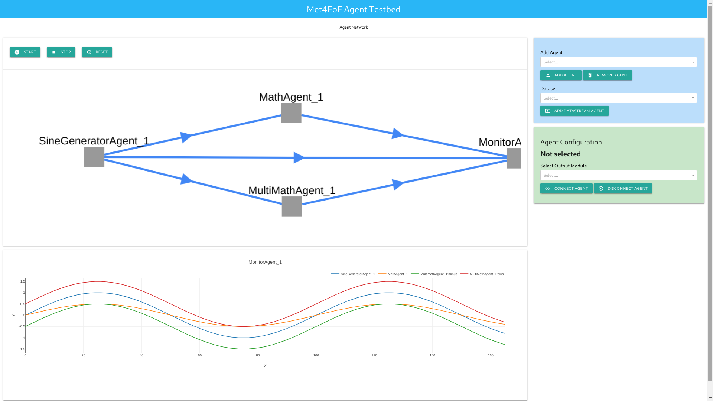

[](https://circleci.com/gh/bangxiangyong/agentMET4FOF)
[](https://agentmet4fof.readthedocs.io/en/latest/?badge=latest)
[](https://codecov.io/gh/bangxiangyong/agentMet4FoF)

# Multi-Agent System for Metrology for Factory of the Future (Met4FoF) Code
This is supported by European Metrology Programme for Innovation and Research (EMPIR) under the project Metrology for the Factory of the Future (Met4FoF), project number 17IND12. (https://www.ptb.de/empir2018/met4fof/home/)

About
---
 - How can metrological input be incorporated into an agent-based system for addressing uncertainty of machine learning in future manufacturing?
 - Includes agent-based simulation and implementation
 - Readthedocs documentation is available at (https://agentmet4fof.readthedocs.io)

Get started
---
First clone the repository to your local machine as described
[here](https://help.github.com/en/articles/cloning-a-repository). To get started
with your present *Anaconda* installation just go to *Anaconda
prompt*, navigate to your local clone
```
cd /your/local/folder/agentMet4FoF
```
and execute
```
conda env create --file environment.yml 
```
This will create an *Anaconda* virtual environment with all dependencies
satisfied. If you don't have *Anaconda* installed already follow [this guide
](https://docs.conda.io/projects/continuumio-conda/en/latest/user-guide/install/download.html)
first, then create the virtual environment as stated above and then proceed.

First take a look at the [tutorials](./tutorials/tutorial_1_generator_agent.py) and [examples](./examples)
or start hacking the [main_agent_network.py](main_agent_network.py) if you already are
familiar with agentMet4FoF and want to customize your agents' network.

Updates
---
 - Implemented base class AgentMET4FOF with built-in agent classes DataStreamAgent, MonitorAgent
 - Implemented class AgentNetwork to start or connect to a agent server
 - Implemented with ZEMA prognosis of Electromechanical cylinder data set as use case [](https://doi.org/10.5281/zenodo.1326278)
 - Implemented interactive web application with user interface


## Screenshot of web visualization


Note
---
 - In the event of agents not terminating cleanly, run ```taskkill /f /im python.exe /t``` in Windows Command Prompt to terminate all background python processes.
