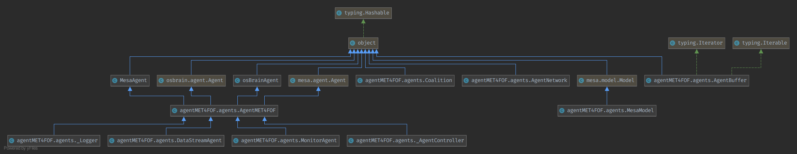
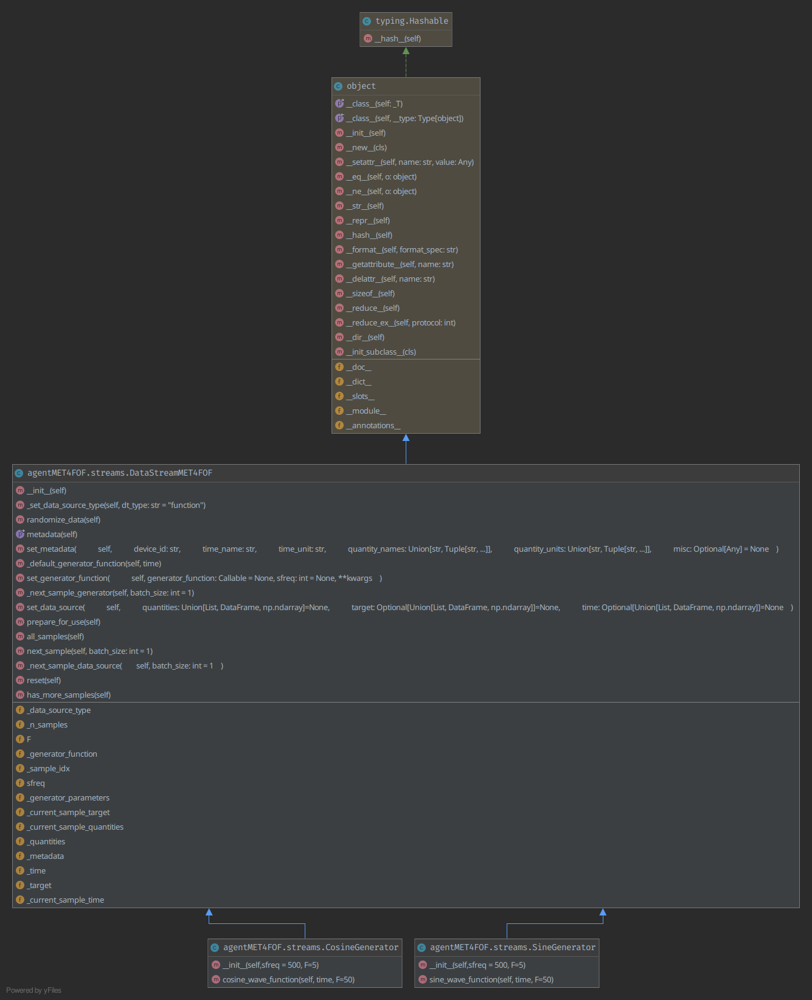
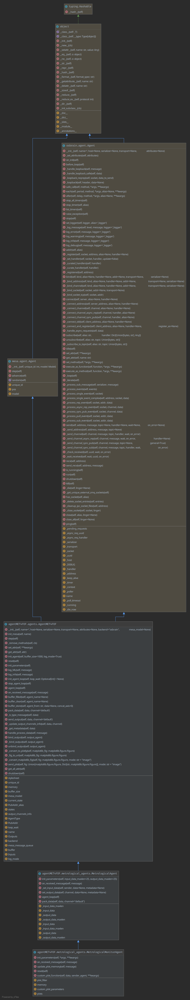
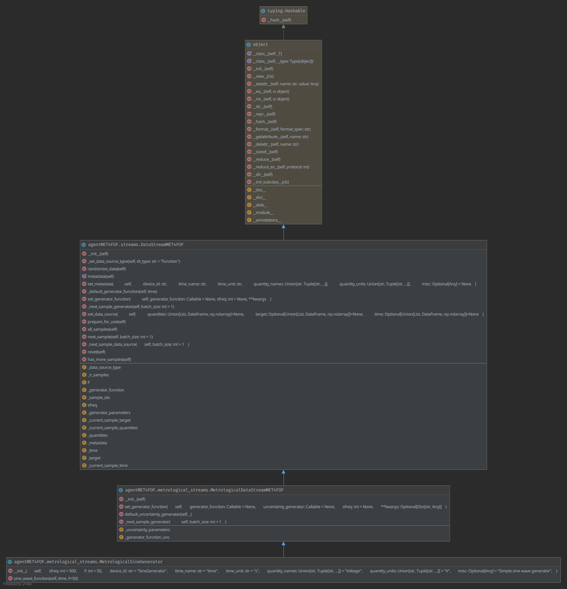

# UML diagrams of agentMET4FOF

In this section UML class diagrams of almost all components of agentMET4FOF are listed and shown. The images are click- and zoomable in the browser but can be downloaded for further investigation via right-click. 

## Overview

## UML class diagram of _agentMET4FOF.agents_

## UML class diagram of _agentMET4FOF.streams_

## UML class diagram of _agentMET4FOF.metrological_agents_

## UML class diagram of _agentMET4FOF.metrological_agents_

## Creation of the UMLs

We used _PyCharm Professional_ to create the diagrams in "Hierarchic Group Layout".

Date of creation for all diagrams: 2021-02-03 on commit [54a4863](https://github.com/Met4FoF/agentMET4FOF/tree/54a48630017a62b085f1c76b3bd98fa3b12f9fba).
